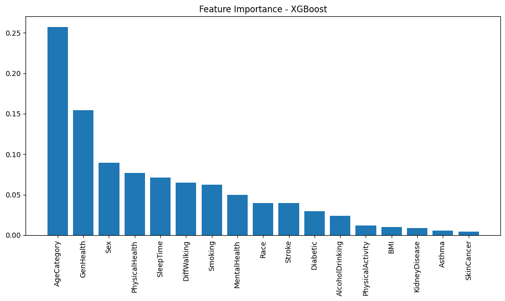
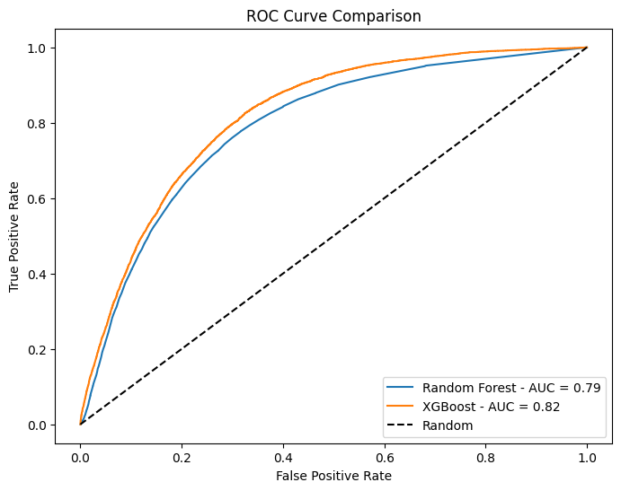

# Heart Disease Model Comparison

## Overview
This project compares multiple machine learning models for predicting heart disease risk, with a focus on proper handling of imbalanced data and methodological rigor. This is an advanced follow-up to my [baseline project](https://github.com/RoyaHajimalek/heart-disease-ai).

## Dataset
Source: [Kaggle - Personal Key Indicators of Heart Disease (2020)](https://www.kaggle.com/datasets/kamilpytlak/personal-key-indicators-of-heart-disease)
- Size: 319,795 records, 18 features
- Target: HeartDisease (Yes/No)
- Class imbalance: 8.5% positive cases

## Models Compared
- Logistic Regression (baseline)
- Neural Network (Dense layers with Dropout)
- Random Forest
- XGBoost

## Methodology
1. Data preprocessing and label encoding
2. Train/test split (80/20)
3. Feature scaling with StandardScaler
4. SMOTE for handling class imbalance
5. 5-fold Stratified Cross-Validation for robust evaluation
6. Feature importance analysis using XGBoost

## Key Finding: Data Leakage Detection
During cross-validation, applying SMOTE before splitting resulted in artificially inflated AUC scores (0.97) due to data leakage between synthetic samples. This was corrected using an imbalanced-learn Pipeline that applies SMOTE only within each training fold, yielding realistic and reliable results.

## Results

| Model | AUC (Cross-Validation) | Recall (Test) |
|-------|------------------------|----------------|
| Logistic Regression | 0.828 ± 0.0007 | 77% |
| XGBoost | 0.823 ± 0.0011 | 55% (threshold=0.3) |
| Neural Network | ~0.83 | 64% |
| Random Forest | 0.79 | 23-46% |

**Key insight:** Contrary to common assumptions, the simpler Logistic Regression model achieved competitive or superior performance compared to more complex models, particularly in Recall — a critical metric for medical screening applications.

## Feature Importance
Top predictive features (XGBoost):
1. AgeCategory (0.257)
2. GenHealth (0.155)
3. Sex (0.089)
4. PhysicalHealth (0.077)
5. SleepTime (0.071)

## ROC Curve Comparison

## Tools
- Python, Scikit-learn, XGBoost
- Imbalanced-learn (SMOTE)
- Pandas, NumPy, Matplotlib

## How to Run
1. Download the dataset from the Kaggle link above
2. Open the notebook in Google Colab
3. Upload the dataset CSV file when prompted
4. Run all cells in order

## Author
Roya Hajimalek - AI Researcher
